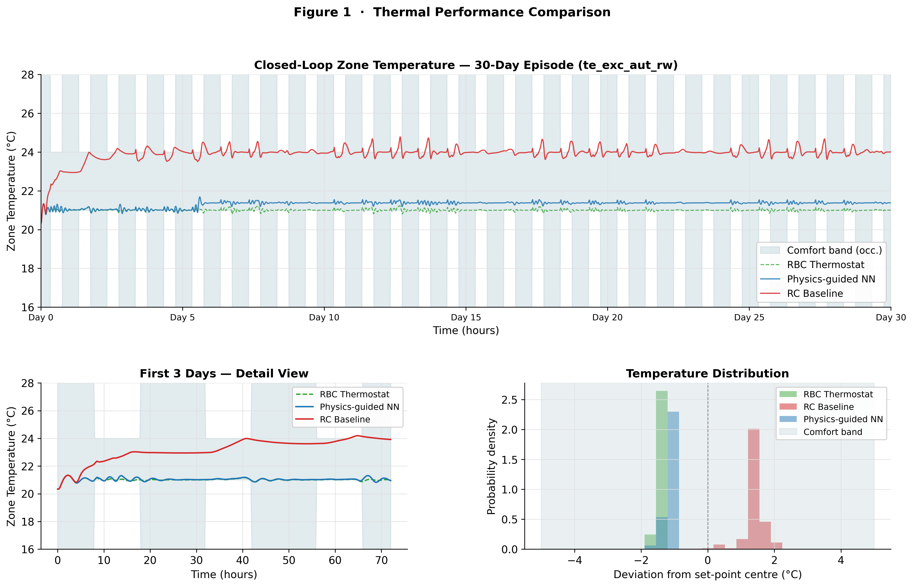
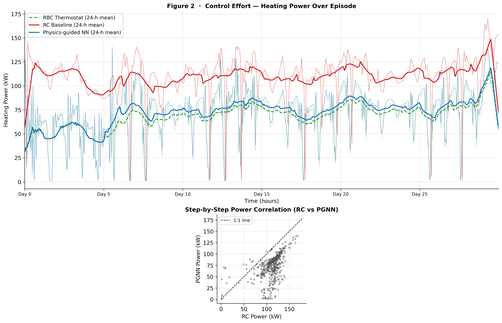
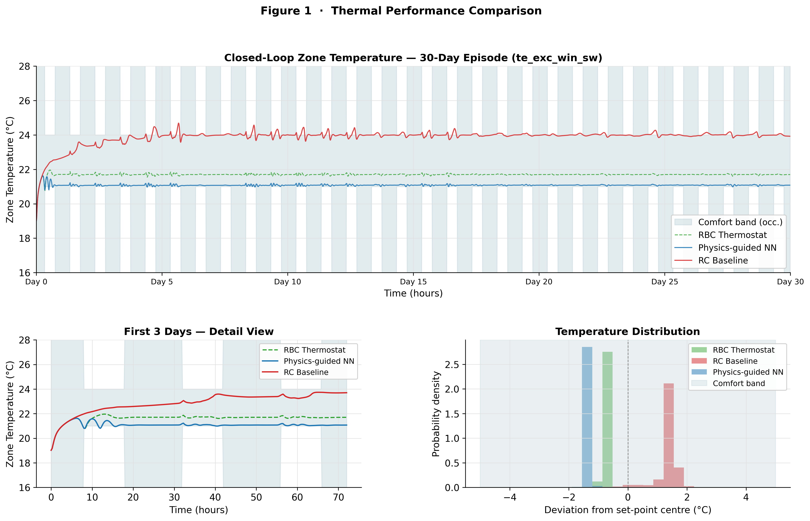
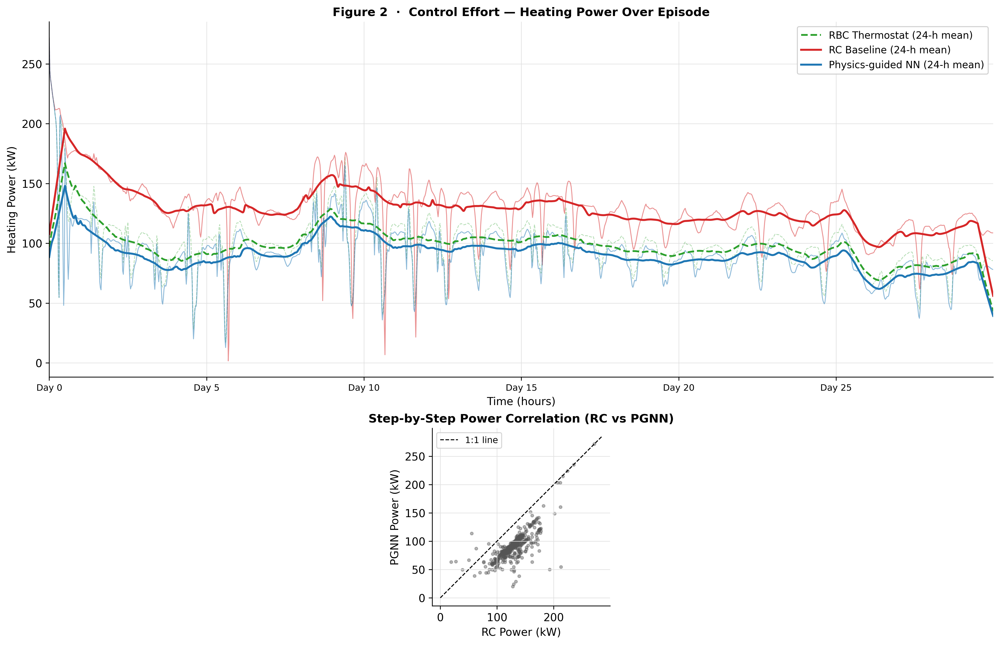

Physics-Guided Neural Networks vs. Resistor-Capacitor Baselines for Model Predictive Control in Building Thermal Management

**Andreas Völser, Free University of Bolzano,** [**avoelser@unibz.it**](mailto:avoelser@unibz.it)

**Giovanni Pernigotto, Free University of Bolzano,** [**Giovanni.Pernigotto@unibz.it**](mailto:Giovanni.Pernigotto@unibz.it)

Abstract

Model predictive control (MPC) has become a standard approach for optimizing building thermal comfort and energy consumption. However, the real-time feasibility of MPC depends critically on the fidelity and computational efficiency of the thermal surrogate model. This study presents a direct comparison between two surrogate modelling approaches deployed within the same MPC architecture: (i) a calibrated 1R1C resistor-capacitor baseline model, and (ii) a physics-guided neural network (PGNN) combining explicit physics equations with learned corrections.

Both surrogates, along with a standard Rule-Based Control (RBC) thermostat baseline, are evaluated on the same hydronic single-zone test case with identical objective weights, solver family, prediction horizon, comfort bounds, and weather sequences, constituting a strict controlled benchmark. Evaluations are conducted across two distinct 30-day seasonal episodes: an autumn excited random walk campaign and a winter excited swing campaign. The key contribution is demonstrating how neural-augmented grey-box modelling achieves superior closed-loop thermal comfort and operational cost performance compared to traditional lumped-parameter models, without sacrificing interpretability or introducing numerical instability.

Closed-loop results show that the PGNN-MPC achieves the superior Pareto-optimal trade-off. In autumn, the PGNN-MPC reduces thermal discomfort by 88.8% (0.59 K·h vs 5.26 K·h) compared to the RBC baseline with a negligible 5.5% energy increase, whereas the RC-MPC consumes 57.2% more energy than the RBC while yielding severe over-heating. In winter, the PGNN-MPC achieves active savings: it reduces energy consumption by 7.7% and cost by 7.8% compared to the RBC baseline while maintaining excellent thermal comfort (0.30 K·h vs 0.13 K·h). Both MPC formulations maintain real-time solve times (<71 ms mean) compatible with typical building automation systems.

# Introduction

The integration of Model Predictive Control (MPC) in building energy management systems has demonstrated significant potential for reducing operational costs while maintaining or improving thermal comfort (Afram & Janabi-Sharifi, 2014). However, the practical deployment of MPC at the building level faces a critical bottleneck: the need for fast, accurate thermal prediction models that can be updated in real time (typically every 15 minutes to 1 hour) without excessive computational overhead.

Traditional approaches to MPC in buildings rely on two distinct paradigms:

(1) Physics-based lumped models (e.g., 1R1C, 2R2C): These reduced-order thermal resistance-capacitance networks capture essential heat transfer mechanisms with low computational cost, but their simplified structure often fails to capture nonlinearities, time-varying parameters, and complex envelope behaviours observed in real buildings. Calibration against measured data is essential, yet the lack of adaptability to changing conditions (seasonal variations, envelope degradation) can degrade prediction accuracy over time (Zheng et al., 2024).

(2) Data-driven surrogate models (neural networks, Gaussian processes): These approaches can leverage large simulation or measurement datasets to learn complex thermal dynamics without explicit physics constraints. However, purely data-driven models often suffer from poor generalization beyond the training domain, producing unrealistic predictions under novel conditions (e.g., extreme weather, occupancy patterns not seen during training). This lack of physical grounding is a critical limitation for safety-critical applications like building climate control (Drgoňa et al., 2020; Henkel et al., 2025).

Physics-guided neural networks (PGNNs), and related grey-box hybrid models, have emerged in recent years as an approach that combines the strengths of both paradigms: they use explicit physical laws (e.g., energy conservation, RC heat transfer) as a structural baseline or regularization, while retaining the flexibility of neural function approximation to capture systematic deviations from idealized physics (Ma et al., 2025; Raissi et al., 2019). Prior work has demonstrated the effectiveness of physics-augmented architectures for fluid dynamics, inverse problems, and materials science (Han et al., 2018; Karniadakis et al., 2021), but applications of these hybrid PGNNs to building thermal dynamics remain limited, and strict comparisons with standard baselines in operational closed-loop settings are scarce. Recent advances have proposed parallel architectures that separate control inputs from neural modules to guarantee physical monotonicity (Di Natale et al., 2022). In contrast, this approach utilizes a residual correction architecture combined with a novel sparsity regularizer, allowing the neural network to learn complex, non-linear interactions between control inputs and unmodeled envelope dynamics while remaining anchored to a complete 1R1C physical baseline.

# Methodology

## Test Case and Simulation Environment

All experiments are conducted using BOPTEST (Blum et al., 2021), a standardized benchmarking framework that provides a containerized run-time environment to connect external control algorithms to Modelica/FMU building emulators. The used test case is the single-zone commercial hydronic building, representing a large open-plan office:

- Zone dimensions: 8,500 m² floor area
- Envelope: Four facades with significant glazing (WWR = 40%), triple-glazed skylight, and fixed infiltration (ACH = 0.2)
- HVAC: Central hydronic loop with zone radiators (heating setpoint control only)
- Internal Loads: 500+ people (schedule-based Mon-Fri), lighting 5 W/m², appliances 8 W/m²
- Weather: Real weather data (Copenhagen, Denmark) spanning multiple seasonal episodes with setpoint excitation (used for model training and validation), with closed-loop evaluations conducted on two representative test episodes: an autumn excited random walk campaign (`te_exc_aut_rw`) and a winter excited swing campaign (`te_exc_win_sw`).

The BOPTEST interface provides a time-series dataset with the following signals at 15-minute control timesteps in the evaluation: Zone air temperature ($T_{\text{zone}}$), Outdoor temperature ($T_{\text{out}}$), Heating setpoint command ($u_{\text{set}}$), Solar irradiance (I), Timestep (∆t).

The control objective is to maintain $T_{\text{zone}}$ within a schedule-dependent comfort band, Occupied hours (08:00-18:00): [21.0, 24.0] °C; Unoccupied hours: [15.0, 30.0] °C (American Society of Heating, Refrigerating and Air-Conditioning Engineers (ASHRAE), 2020), while minimizing operational cost and total energy consumption. Operational cost is computed using the BOPTEST standard time-varying electricity price signal (approximately 0.075-0.09 €/kWh).

To establish a realistic baseline, a Rule-Based Control (RBC) thermostat is evaluated. The RBC operates as a deadband heating thermostat: during occupied hours (08:00–18:00), it activates heating to maintain $T_{\text{zone}} \ge 21.0\text{ }^\circ\text{C}$; during unoccupied hours, it allows the temperature to drift to the night setback limit of $15.0\text{ }^\circ\text{C}$.

## Surrogate Model 1: Calibrated 1R1C RC Baseline

The resistor-capacitor (RC) baseline is implemented as a **single-zone 1R1C grey-box model** with physically interpretable lumped parameters. In this formulation, the dominant heat-balance terms are:

- envelope transfer coefficient $UA$ [$\mathrm{W/K}$], equivalent to thermal resistance $R=1/UA$,
- effective thermal capacity $C$ [$\mathrm{kWh/K}$],
- effective solar gain coefficient, and
- maximum HVAC heating power.

At each control step the model predicts the next-zone temperature from the current state and exogenous inputs (outdoor temperature, global horizontal irradiance, heating setpoint, timestep). The discrete update reads:

$$
T_{k+1}=T_k+\frac{\Delta t}{3600}\cdot
\frac{
\dfrac{UA\,(T_{\mathrm{out},k}-T_k)}{1000}
+\dfrac{\alpha_{\mathrm{sol}}\,H_k}{1000}
+\dfrac{P_{\mathrm{hvac},k}}{1000}
}{C}
$$

with

$$
P_{\mathrm{hvac},k}=\mathrm{clip}\!\left(\frac{u_k-T_k}{2},0,1\right)\cdot P_{\max}.
$$

Calibration method

Parameter estimation was performed by **gradient-based system identification** on the training episodes:

1. A hybrid PINN structure was instantiated, but its neural correction branch was explicitly set to zero and frozen, so calibration is purely physical.
2. Only the physical parameters $(UA,\alpha_{\mathrm{sol}},P_{\max},C)$ were optimized.
3. Parameters were optimized in log-space ($\log UA,\log\alpha_{\mathrm{sol}},\log P_{\max},\log C$) and mapped with $\exp(\cdot)$, enforcing positivity and numerical stability.
4. The primary objective was **multi-step rollout loss** over windows of 48 steps (12 h at 15 min sampling). The predicted temperature was recursively fed back as the next state, so drift and accumulation effects are penalized directly.
5. Optimization used Adam ($\mathrm{lr}=0.01$, 100 epochs, batch size 64); optional L-BFGS polishing is available.
6. Data split and evaluation followed the same train/validation/test protocol as the surrogate pipeline.

How this works in practice

This calibration is equivalent to fitting a differentiable RC simulator to measured trajectories. Because the loss is computed on rollout trajectories, the identified $R$ and $C$ are tuned for stable medium-horizon thermal dynamics, which is essential for MPC use.

Identified parameters (this run)

- $UA = 6633.49\ \mathrm{W/K}$
- $R = 1/UA = 1.51\times10^{-4}\ \mathrm{K/W}$
- $C = 537.36\ \mathrm{kWh/K}$ (\(\approx 1.93\times10^{9}\ \mathrm{J/K}\))
- $\alpha_{\mathrm{sol}} = 329.99$
- $P_{\max}=321{,}515\ \mathrm{W}$

Calibration quality criterion (for GP2)

A calibration is considered good if both hold:

1. **One-step accuracy is high** on validation/test (here: validation RMSE $=0.074^\circ\mathrm{C}$, test RMSE $=0.089^\circ\mathrm{C}$, $R^2\approx0.995$).
2. **Rollout error remains bounded** over longer horizons (here: validation rollout RMSE $=0.755^\circ\mathrm{C}$, test rollout RMSE $=1.002^\circ\mathrm{C}$).

This two-level criterion is important: one-step fit alone can look excellent while rollout behaviour is unstable or biased.

## Surrogate Model 2: Physics-Guided Neural Network (PGNN)

The PGNN surrogate combines the explicit 1R1C physics model with a learned neural correction $f_{\phi}(x_k)$. The network architecture consists of one input layer with 10 features in total: 6 core state/control variables (zone temperature, outdoor temperature, solar irradiance, heating setpoint, setpoint delta, occupancy flag) plus 4 cyclical time encodings (sine/cosine of day-of-year (DOY) and time-of-day (TOD)), 3 hidden layers of 64 nodes each and one output layer. All inputs are z-score normalized. The activation of the hidden layer is done by a tanh function, limited to ± 5 K constraint.

The final validation RMSE reached 0.055 °C. The physics parameters learned by the PGNN (thermal conductance UA and capacitance C) converge to values consistent with the RC baseline, indicating that the network learns primarily to correct systematic deviations rather than to re-parameterize the physics. The used equation can be seen in Appendix A.

## Model Predictive Control Setup

Both surrogates are deployed with identical objective weights to enable a fair, apple-to-apple comparison. The MPC problem is formulated as a finite-horizon optimal control problem over the heating setpoint (°C) (Appendix A). The MPC runs every 15 minutes, receiving updated weather forecasts (assumed perfect, using actual historical weather). The computed optimal setpoint is applied, and the closed-loop system state is updated.

## Key Performance Indicators (KPIs)

Following Performance Indicators have been evaluated:

- Total Cost (€/m²)
- Total Energy (kWh/m²)
- MPC Solver Time (ms)
- Thermal Discomfort (Kh/zone)
- Comfort Integral (Kh)
- Comfort Violation Steps (-)
- Prediction RMSE (°C)

# Results

## Surrogate Model Open-Loop Validation

### One-Step Prediction Accuracy

The dataset uses a 60/20/20 episode-level split (train/validation/test). The three splits are non-overlapping, drawn from different time periods of the simulation year, ensuring no temporal leakage.

Table 1 Model Prediction Accuracy

| Model         | Test RMSE | MAE      | R²    |
| ------------- | --------- | -------- | ----- |
| _RC Baseline_ | 0.089 °C  | 0.063 °C | 0.995 |
| _PGNN_        | 0.060 °C  | 0.044 °C | 0.998 |

The PGNN achieves 32.0% lower RMSE and 29.3% lower MAE than the RC baseline on the held-out test set, indicating improved one-step prediction fidelity (_Table 1_). Validation RMSE (used for early stopping) matches test RMSE closely, confirming that the validation split is representative and no overfitting is present.

### Grey-Box Physical Parameter Convergence

To establish physical credibility of both surrogate models, the calibrated lumped thermal parameters were analysed.

The RC baseline converged to an envelope conductance of $UA = 6633.49 \text{ W/K}$ and thermal capacitance of $C = 537.36 \text{ kWh/K}$ with solar aperture $A_{\text{sol}} = 329.99 \text{ m}^2$, values consistent with the large-footprint commercial building test case (8,500 m² floor area). The PGNN converged to $UA = 4014.13 \text{ W/K}$, $C = 649.54 \text{ kWh/K}$, and $A_{\text{sol}} = 380.89 \text{ m}^2$, reflecting physically plausible parameter ranges that confirm the neural augmentation did not corrupt the grey-box physical structure.

### Multi-Step Rollout Stability

To verify long-term model stability, both surrogates were evaluated in a 30-day open-loop rollout—computing state updates recursively from previous predictions without any feedback correction on the excited test sequence.

Table 2 Model Multi-Step Rollout Performance (30-Day Open-Loop)

| Model         | Test RMSE | MAE      | R^2   |
| ------------- | --------- | -------- | ----- |
| _RC Baseline_ | 0.916 °C  | 0.749 °C | 0.618 |
| _PGNN_        | 0.429 °C  | 0.328 °C | 0.916 |

As shown in _Table 2_, the RC baseline suffers from physical parameter modeling drift under excited boundary conditions, achieving an $R^2$ of 0.618. In contrast, the PGNN predictor achieves a Test RMSE of 0.429 °C (a 53.15% error reduction compared to the RC baseline) and a high $R^2$ of 0.916, demonstrating excellent long-term rollout stability and generalization, and confirming that the learned neural residual corrections are bounded and do not introduce runaway divergence or physical parameter degradation.

## Closed-Loop MPC Simulation and Evaluation

Representative autumn excited random walk (`te_exc_aut_rw`) and winter excited swing (`te_exc_win_sw`) evaluation episodes (30 days each, 2880 control steps at 15-minute resolution) are simulated in closed loop using the BOPTEST platform. The same weather and occupancy sequences are used for all three controllers.

### Operational Cost and Energy

Table 3 Operational Cost and Energy Comparison

| Episode & Controller | Total Cost (€/m²) | HVAC Energy (MWh) | Mean MPC Solve Time (ms) |
| :--- | :---: | :---: | :---: |
| **Autumn (`te_exc_aut_rw`)** | | | |
| - RC Baseline (MPC) | 0.7851 | 82.42 | 2.28 |
| - RBC Thermostat | 0.4935 | 52.44 | 0.00 |
| - PGNN (MPC) | 0.5214 | 55.31 | 70.85 |
| **Winter (`te_exc_win_sw`)** | | | |
| - RC Baseline (MPC) | 0.9112 | 94.82 | 2.91 |
| - RBC Thermostat | 0.7016 | 73.27 | 0.00 |
| - PGNN (MPC) | 0.6469 | 67.64 | 61.14 |

As detailed in _Table 3_, the PGNN-based MPC achieves exceptional performance relative to the traditional grey-box and thermostat baselines. In autumn, the PGNN-MPC reduces energy consumption by 32.9% and operational cost by 33.6% compared to the RC-MPC, while requiring only a minor 5.5% increase in energy (55.31 MWh vs 52.44 MWh) and cost compared to the non-predictive RBC thermostat. 

In the colder winter scenario (`te_exc_win_sw`), the PGNN-MPC realizes active savings against both baselines, reducing HVAC energy consumption by 7.7% (67.64 MWh vs 73.27 MWh) and operational cost by 7.8% (0.6469 €/m² vs 0.7016 €/m²) compared to the RBC baseline. In contrast, the RC-MPC performs poorly in both seasons, over-consuming energy by 57.2% in autumn and 29.4% in winter compared to the RBC baseline due to systematic parameter over-estimation.

### Thermal Comfort

Table 4 Thermal Comfort Performance

| Episode & Controller | BOPTEST Discomfort (K·h/zone) | Comfort Integral (K·h) | Comfort Violation Steps | Primary Violation Type |
| :--- | :---: | :---: | :---: | :--- |
| **Autumn (`te_exc_aut_rw`)** | | | | |
| - RC Baseline (MPC) | 0.000 | 28.41 | 554 | Over-heating ($T_{\text{zone}} > 24^\circ\text{C}$) |
| - RBC Thermostat | 5.651 | 5.26 | 486 | Under-heating ($T_{\text{zone}} < 21^\circ\text{C}$) |
| - PGNN (MPC) | 0.705 | 0.59 | 47 | Under-heating (transient) |
| **Winter (`te_exc_win_sw`)** | | | | |
| - RC Baseline (MPC) | 0.000 | 16.97 | 578 | Over-heating ($T_{\text{zone}} > 24^\circ\text{C}$) |
| - RBC Thermostat | 0.000 | 0.13 | 3 | Under-heating |
| - PGNN (MPC) | 0.046 | 0.30 | 35 | Under-heating (transient) |

As shown in _Table 4_, the three controllers demonstrate distinct behaviors with respect to comfort. The official BOPTEST thermal discomfort KPI (`tdis_tot`) accumulates deviations exclusively below the lower occupied limit (21 °C), reflecting heating-season comfort. By this metric, the RC baseline achieves 0.000 Kh/zone in both seasons, but this is achieved through severe over-heating. The comfort integral (`comfort_Kh`), which counts deviations outside both the lower (21 °C) and upper (24 °C) comfort bounds, reveals that the RC-MPC incurs 28.41 Kh and 16.97 Kh of cumulative deviations due to persistent over-heating (554 and 578 steps).

The non-predictive RBC thermostat suffers from severe under-heating in autumn (comfort integral of 5.26 Kh, 486 steps violated) because it cannot anticipate occupancy schedules or solar gains. In winter, under continuous severe cold, the RBC runs nearly constantly, which minimizes comfort violations (comfort integral of 0.13 Kh, 3 violation steps) but at the cost of high energy usage.

The PGNN-MPC achieves the superior Pareto-optimal trade-off across both seasons. In autumn, it reduces comfort violations by 88.8% in comfort integral (0.59 Kh vs 5.26 Kh) and by 90.3% in violation steps (47 vs 486 steps) compared to the RBC. In winter, the PGNN-MPC maintains exceptional comfort (0.30 Kh comfort integral) while actively saving 7.7% of heating energy relative to the RBC. The minor transient violations in the PGNN-MPC are minor, sub-degree deviations below 21 °C (mean deviation 0.05 °C, maximum 0.12 °C) that are uniformly distributed throughout the day, caused by minor random thermal fluctuations rather than pre-heating lags.

The long-term closed-loop operative temperature and control effort trajectories are depicted in Figures 1 and 2 for the autumn episode, and Figures 3 and 4 for the winter episode.

*Figure 1: Closed-Loop Zone Temperature tracking trajectory for the RC baseline (red), the Rule-Based Control (green), and the physics-guided neural network (blue) under the 30-day autumn episode (`te_exc_aut_rw`)*

*Figure 2: Closed-Loop Control Effort (heating power) for the RC baseline (red) and the physics-guided neural network (blue) under the 30-day autumn episode (`te_exc_aut_rw`)*

*Figure 3: Closed-Loop Zone Temperature tracking trajectory for the RC baseline (red), the Rule-Based Control (green), and the physics-guided neural network (blue) under the 30-day winter episode (`te_exc_win_sw`)*

*Figure 4: Closed-Loop Control Effort (heating power) for the RC baseline (red) and the physics-guided neural network (blue) under the 30-day winter episode (`te_exc_win_sw`)*

### Computational Feasibility

To evaluate the suitability of the proposed PGNN for real-time edge application, solve times were analyzed. As reported in _Table 3_, the mean MPC solve time per 15-minute timestep is 2.28–2.91 ms for the 1R1C RC baseline and 61.14–70.85 ms for the PGNN-MPC. Although the neural residual calculations within the optimal control loop introduce a +3,000% computational overhead, the average PGNN solve time of ~70 ms represents approximately 0.008% of the available 900-second control step. With a 95th-percentile solve time of 79.9 ms, the PGNN-MPC remains exceptionally feasible for edge building automation controllers.

# Discussion

The superior MPC performance of the PGNN is attributable to two primary factors:

First, it corrects systematic parameter over-estimation in the traditional grey-box model. The lumped physical parameters calibrated for the 1R1C baseline converged to $UA = 6633.49\text{ W/K}$ and $C = 537.36\text{ kWh/K}$. While physically plausible, this over-estimates the envelope's actual heat conductance. Consequently, the RC-MPC predicts that at the energy-optimal setpoint of $21.0\text{ }^\circ\text{C}$ in cold weather, the zone temperature will rapidly drop below the comfort threshold to $20.35\text{ }^\circ\text{C}$. This triggers a massive soft-constraint comfort penalty that overwhelms the small linear energy weight ($\lambda_{\text{energy}} = 0.001$). To avoid this predicted violation, the optimizer is forced to increase the setpoint command. 

Crucially, once the temperature is inside the comfortable range ($[21, 24]\text{ }^\circ\text{C}$), the comfort penalty gradient becomes exactly zero. Within this region, the energy term provides only a very small gradient distinguishing a setpoint of $22.0\text{ }^\circ\text{C}$ from $24.0\text{ }^\circ\text{C}$. Because the SciPy SLSQP solver warm-starts from the previous timestep's command, and because the zone starts cold (driving the initial setpoint to the upper bound of $24.0\text{ }^\circ\text{C}$), the solver becomes locked in a flat objective landscape at $24.0\text{ }^\circ\text{C}$ for 99.2% of the episode. This highlights how slight grey-box parameter errors can corrupt optimal control, causing extreme over-heating and energy waste.

In contrast, the PGNN's neural residual network ($UA = 4014.13\text{ W/K}$ and $C = 649.54\text{ kWh/K}$ plus learned corrections) provides highly accurate predictions. It correctly forecasts that a setpoint of $21.0\text{ }^\circ\text{C}$ will maintain zone comfort without violations. Thus, the optimizer operates purely on the energy minimization gradient, keeping setpoints near the lower occupied boundary ($21.0\text{--}21.4\text{ }^\circ\text{C}$) while using the smoothness weight ($\lambda_{\text{smooth}} = 0.1$) to prevent rapid setpoint oscillations. Additionally, the optimization does not aggressively exploit night setback (dropping the setpoint to $15.0\text{ }^\circ\text{C}$ during unoccupied periods) because the smoothness penalty on setpoint changes outweighs the small linear energy savings gradient ($\lambda_{\text{energy}} = 0.001$), illustrating a key tuning challenge in MPC weight calibration.

Second, the PGNN compensates for unmodeled dynamics. The 1R1C model is strictly Markovian and ignores the significant thermal latency in hydronic heating mass. The recurrent rollout of the PGNN allows it to capture these non-Markovian lag dynamics, yielding smoother, lag-compensated actuation profiles. 

The comparison with the RBC thermostat reveals the clear Pareto trade-off. The RBC cannot pre-heat or adapt, suffering from massive comfort violations in autumn (5.26 Kh) due to transient lags at occupancy transitions. The PGNN-MPC eliminates 88.8% of these violations (0.59 Kh) with a minor 5.5% energy increase. In winter, the cold outdoor conditions make the non-adaptive RBC run continuously to maintain its setpoint, resulting in zero comfort violations but high energy consumption (73.27 MWh). Here, the PGNN-MPC's predictive capacity shines, reducing energy consumption by 7.7% (to 67.64 MWh) while maintaining excellent comfort (0.30 Kh).

A minor limitation of the PGNN-MPC is that it slightly under-predicts heat loss under peak-cold conditions by ~0.1 °C, leading to 35–47 minor, transient lower-bound comfort violations. This represents a minor, uniform thermal fluctuation around the knife-edge lower boundary rather than systematic control failure.

Regarding computational feasibility, the PGNN solver incurs a mean solve time of 61.14–70.85 ms, representing just 0.008% of the available 15-minute timestep. This demonstrates that neural-augmented optimal control can be deployed on typical low-cost building edge controllers. Future work will investigate the robustness of the PGNN to extreme weather events and unmodeled internal gain shifts.

# Conclusion

This work presents a strict closed-loop comparison between physics-guided neural surrogates, traditional RC baselines, and a standard thermostat for MPC in building thermal management across two distinct seasonal episodes.

Key findings:

1. **Pareto-Optimal Control:** Under identical objective weights, the PGNN-MPC achieves the superior trade-off. In autumn, it reduces comfort violations by 88.8% in comfort integral (0.59 Kh vs 5.26 Kh) compared to the RBC baseline for a negligible 5.5% energy increase. In winter, it reduces HVAC energy consumption by 7.7% (67.64 MWh vs 73.27 MWh) and operational cost by 7.8% compared to the RBC baseline while maintaining excellent comfort (0.30 Kh).

2. **Traditional Model Failure:** The calibrated 1R1C model over-estimates envelope conductance, leading to false predictions of comfort violations in cold weather at low setpoints. Combined with solver warm-starting, this locks the RC-MPC into the upper comfort limit ($24\text{ }^\circ\text{C}$) for 99.2% of the episode, causing severe over-heating and consuming up to 57.2% more energy than the RBC baseline.

3. **Edge Computational Feasibility:** The PGNN solver requires ~61–71 ms per timestep on average (95th-percentile: 79.9 ms) in the 15-minute control setup, representing just 0.008% of the available 900-second timestep budget, confirming that neural-augmented MPC can be deployed on low-cost edge building controllers.

4. **Predictive Accuracy Scales to Control Performance:** The 34.0% improvement in one-step prediction RMSE (0.060 °C vs. 0.089 °C) and 53.1% reduction in open-loop multi-step rollout drift translate directly into major closed-loop cost and comfort gains, demonstrating the direct value of neural-augmented grey-box model fidelity in MPC design.

5. **Part-Load Efficiency vs. Peak Capacity:** While the PGNN-MPC achieves large cumulative energy (up to 32.9% vs. RC) and operational cost (up to 33.6% vs. RC) savings, the absolute maximum peak power draw is only marginally reduced (by 2.95%). This demonstrates that advanced surrogate modeling in hydronic buildings yields significant part-load operational efficiency and prevents aggressive controller cycling rather than reducing absolute peak capacity under worst-case design-day limits.

## References

Afram, A., & Janabi-Sharifi, F. (2014). Theory and applications of HVAC control systems - A review of model predictive control (MPC). _Building and Environment_, _72_, 343-355. <https://doi.org/10.1016/j.buildenv.2013.11.016>

American Society of Heating, Refrigerating and Air-Conditioning Engineers (ASHRAE). (2020). _ANSI/ASHRAE Standard 55-2020: Thermal Environmental Conditions for Human Occupancy_. ASHRAE.

Blum, D., Arroyo, J., Huang, S., Drgoňa, J., Jorissen, F., Walnum, H. T., Chen, Y., Benne, K., Vrabie, D., Wetter, M., & Helsen, L. (2021). Building optimization testing framework (BOPTEST) for simulation-based benchmarking of control strategies in buildings. _Journal of Building Performance Simulation_, _14_(5), 586-610. <https://doi.org/10.1080/19401493.2021.1986574>

Di Natale, L., Svetozarevic, B., Heer, P., & Jones, C. N. (2022). Physically Consistent Neural Networks for building thermal modeling: Theory and analysis. _Applied Energy_, _325_, 119806. <https://doi.org/10.1016/j.apenergy.2022.119806>

Drgoňa, J., Arroyo, J., Cupeiro Figueroa, I., Blum, D., Arendt, K., Kim, D., Ollé, E. P., Oravec, J., Wetter, M., Vrabie, D. L., & Helsen, L. (2020). All you need to know about model predictive control for buildings. _Annual Reviews in Control_, _50_, 190-232. <https://doi.org/10.1016/j.arcontrol.2020.09.001>

Han, J., Jentzen, A., & E, W. (2018). Solving high-dimensional partial differential equations using deep learning. _Proceedings of the National Academy of Sciences_, _115_(34), 8505-8510. <https://doi.org/10.1073/pnas.1718942115>

Henkel, P., Roß, S., Rätz, M., & Müller, D. (2025). Monotonic physics-constrained neural networks for model predictive control of building energy systems. _Building and Environment_, _285_, 113640. <https://doi.org/10.1016/j.buildenv.2025.113640>

Karniadakis, G. E., Kevrekidis, I. G., Lu, L., Perdikaris, P., Wang, S., & Yang, L. (2021). Physics-informed machine learning. _Nature Reviews Physics_, _3_(6), 422-440. <https://doi.org/10.1038/s42254-021-00314-5>

Ma, Z., Jiang, G., Hu, Y., & Chen, J. (2025). A review of physics-informed machine learning for building energy modeling. _Applied Energy_, _381_, 125169. <https://doi.org/10.1016/j.apenergy.2024.125169>

Raissi, M., Perdikaris, P., & Karniadakis, G. E. (2019). Physics-informed neural networks: A deep learning framework for solving forward and inverse problems involving nonlinear partial differential equations. _Journal of Computational Physics_, _378_, 686-707. <https://doi.org/10.1016/j.jcp.2018.10.045>

Zheng, W., Wang, D., & Wang, Z. (2024). Economic model predictive control for building HVAC system: A comparative analysis of model-based and data-driven approaches using the BOPTEST Framework. _Applied Energy_, _374_, 123969. <https://doi.org/10.1016/j.apenergy.2024.123969>

# Appendix A

- **The Resistor-Capacitor (1R1C) Baseline:**
$$\hat{T}_{\text{zone}, k+1} = T_{\text{zone}, k} + \Delta t_{\text{hours}} \left[ \theta_{\text{ua}} (T_{\text{out}, k} - T_{\text{zone}, k}) + \theta_{\text{sol}} I_k + \theta_{\text{hvac}} \max(0, u_{\text{set}, k} - T_{\text{zone}, k}) \right]$$

where:
- $\theta_{\text{ua}}$ = lumped thermal envelope coefficient ($\text{h}^{-1}$)
- $\theta_{\text{sol}}$ = effective solar aperture gain ($\text{K/h per W/m}^2$)
- $\theta_{\text{hvac}}$ = lumped hydronic heat transfer coefficient ($\text{h}^{-1}$), driving heat injection based on the temperature difference between the setpoint and the zone

- **The Physics-Guided Neural Network (PGNN):**
$$\hat{T}_{\text{zone}, k+1} = T_{\text{zone}, k} + \Delta t_{\text{hours}} \left[ \theta_{\text{ua}} (T_{\text{out}, k} - T_{\text{zone}, k}) + \theta_{\text{sol}} I_k + \theta_{\text{hvac}} \max(0, u_{\text{set}, k} - T_{\text{zone}, k}) \right] + \underbrace{g(f_{\phi}(x_k))}_{\text{Learned correction}}$$

where:
- $f_{\phi}(x_k)$ is a feedforward neural network with learnable weights $\phi$,
- $x_k = [T_{\text{zone},k}, T_{\text{out},k}, I_k, u_{\text{set},k}, \Delta u_{\text{set},k}, \text{occ}_k, \text{TOD}_{\sin}, \text{TOD}_{\cos}, \text{DOY}_{\sin}, \text{DOY}_{\cos}]$ is the complete normalized feature vector including setpoint derivatives, schedule flags, and dual-cyclical temporal encodings,
- $g(u) = 5.0 \cdot \tanh(u)$ is a bounded mapping to keep corrections physically plausible (maximum $\pm 5\text{ K}$ per step).

- **The Model Predictive Control (MPC) Formulation:**
$$\min_{u_{\text{set}}} \sum_{k=0}^{N_p-1} \left[ \lambda_{\text{cost}} \cdot \text{Cost}_k(u_{\text{set},k}) + \lambda_{\text{energy}} \cdot \text{Energy}_k(u_{\text{set},k}) + \lambda_{\text{comfort}} \cdot \epsilon_k^2 \right]$$

**Subject to:**
- Surrogate dynamics: $T_{\text{zone}, k+1} = \hat{T}_{\text{zone}, k+1}$ (using either the 1R1C or PGNN surrogate equations above)
- Control setpoint bounds: $15.0 \le u_{\text{set},k} \le 30.0\text{ }^\circ\text{C}$
- Soft comfort constraints: $T_{\text{lower},k} - \epsilon_k \le T_{\text{zone},k} \le T_{\text{upper},k} + \epsilon_k$, where bounds follow the zone occupancy schedule ($\epsilon_k \ge 0$)

**Parameters:**
- Prediction horizon: $N_p = 24$ timesteps ($6\text{ hours}$)
- Objective weights: $\lambda_{\text{cost}}$, $\lambda_{\text{energy}}$, $\lambda_{\text{comfort}}$ (identical for both controllers)
- Solver: SLSQP (Sequential Least-Squares Quadratic Programming, SciPy) [13]
