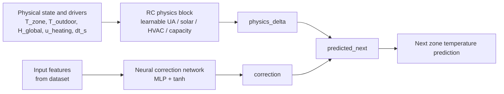

# SingleZonePINN Overview

This model is best understood as a **hybrid gray-box model**:
- The **physics part** is an explicit RC-style temperature update.
- The **neural part** is a learned correction term.
- The **training loss** penalizes the correction so the model stays close to the physics.

## High-level structure



## What the physics block does

In [pinn_model/model.py](pinn_model/model.py#L31), the method `physics_delta()` computes a one-step temperature change using a simple thermal balance:

- heat loss/gain through the envelope from `T_outdoor - T_zone`
- solar gain from `H_global`
- HVAC gain from the heating setpoint / zone temperature gap
- thermal inertia through a capacity term

The learnable physical parameters are:
- `log_ua`
- `log_solar_gain`
- `log_hvac_gain`
- `log_capacity`

They are made positive with `softplus`, so the model learns physically meaningful magnitudes.

## What the correction network does

The neural network is the `self.network` MLP in [pinn_model/model.py](pinn_model/model.py#L8-L19). It is the part of the model that learns patterns the explicit RC physics does not capture well, such as bias, unmodeled dynamics, occupancy effects, or time-dependent residual behavior.

### Where the NN is in the code

The NN lives inside the `SingleZonePINN` class as a small multilayer perceptron:

- input layer: `nn.Linear(input_dim, hidden_dim)`
- hidden layers: repeated `Linear -> Tanh` blocks
- optional dropout: `nn.Dropout(dropout)` if enabled
- output layer: `nn.Linear(hidden_dim, 1)`

So the network itself does not output a full temperature trajectory. It outputs one scalar correction for the next time step.

### What the NN sees

The network input is the `features` vector from [pinn_model/data.py](pinn_model/data.py#L124-L136). Those features include:

- current zone temperature
- outdoor temperature
- solar irradiation
- heating setpoint
- change in heating setpoint
- occupancy flag
- daily and yearly sine/cosine time encodings

This means the NN is not blind: it gets both physical measurements and contextual signals, and it learns how those contexts modify the next-step temperature beyond the RC equation.

### What the NN outputs

It outputs a single scalar correction:

```python
correction = 5.0 * tanh(network(features))
```

So the correction is limited to roughly `[-5, +5] K`.

Interpretation:

- positive correction: the explicit physics under-predicts the next zone temperature
- negative correction: the explicit physics over-predicts the next zone temperature

### How the NN affects the prediction

The correction is added directly to the physics-based update:

```python
predicted_next = t_zone + physics_delta + correction
```

That means the NN does not replace the physics. It acts as a residual term on top of the RC model.

### Why it is constrained

The correction is intentionally bounded by `tanh`, and the training loop also penalizes its magnitude with `physics_loss = mean(correction^2)` in [pinn_model/training.py](pinn_model/training.py#L303-L309).

So the NN is allowed to help only where the simple physics model is insufficient. It is not supposed to learn the whole temperature dynamics by itself.

### Practical reading

You can think of the NN as learning a soft error model:

- the RC block gives the first physical estimate
- the NN learns the leftover mismatch
- the loss keeps that leftover small

That is why this is better described as a hybrid physics-guided residual model than as a pure PINN.

## How they combine

The forward pass in [pinn_model/model.py](pinn_model/model.py#L57-L73) is:

```python
predicted_next = t_zone + physics_delta + correction
```

So the prediction is the sum of:
- current zone temperature
- explicit physics increment
- learned residual correction

## What the loss enforces

In [pinn_model/training.py](pinn_model/training.py#L303-L309), training uses:

- `data_loss`: prediction error against the next measured temperature
- `physics_loss`: mean squared correction size

That means the “physics loss” here is **not** a PDE/ODE residual loss in the classic PINN sense. It is a **regularization term** that discourages the neural correction from growing too large.

## Correct terminology

The most accurate names for this model are:
- physics-guided hybrid model
- gray-box RC + neural residual model
- physics-informed residual learner

If you want to be strict, this is **not** a standard PINN, because a standard PINN usually learns a differential equation residual directly. Here, the physics is already hard-coded in the architecture, and the NN only learns a correction on top.

## Short summary

- **Physics:** explicit RC heat-balance update
- **Neural network:** residual correction from feature history/context
- **Loss:** data fit + penalty on correction magnitude
- **Best label:** hybrid gray-box model, not a canonical PINN
